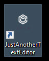
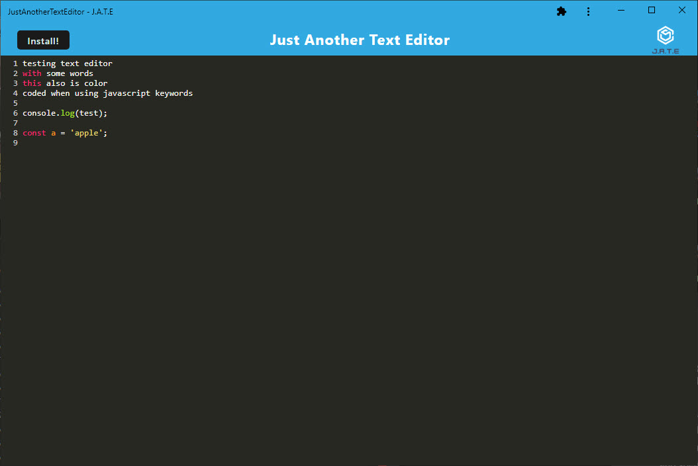

# Text-Editor-PWA

## Description

Text-Editor-PWA is a progressive web application allowing you to use a text editor anywhere, anytime, and without internet connectivity. It utilizes IndexedDB to store the edits locally on your device.

---

## Link to application

---

## Table of Contents

- [Installation](#installation)
- [Usage](#usage)
- [Contributing](#contributing)
- [Tests](#tests)
- [Questions](#questions)

---

## Installation

To use the application, access the link above.

To review and update the application code, clone the repository, run npm install.

---

## Usage

Free to use

---

## Contributing

Provide credit to this repository

---

## Tests

No tests created

---

## Questions

Please contact the owner with any questions.
Email: yiladien@hotmail.com
GitHub profile: https://github.com/Yiladien

---
